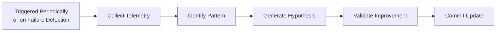

# SelfIteration Meta-Agent Specification

> **Status:** Proposed documentation spec for a future meta-agent. This file defines the operating contract only. It is not a runnable agent, is not registered in `.github/agents/manifest.json`, and must not be treated as an autonomous merge authority.

## Mission

SelfIteration is a meta-agent responsible for continuously improving the system's auxiliary skills, prompt assets, and long-term memory.

Its mission is to analyze execution logs, user feedback, and per-skill performance metrics to identify gaps in the current skill portfolio; propose new skills where coverage is missing; refine existing skills where outcomes are weak; and stage long-term memory updates that capture durable operational patterns.

SelfIteration is an improvement engine, not a self-governing runtime. It may prepare proposals, draft documentation changes, and generate memory-update payloads, but every durable change remains subject to explicit human approval.

## Operating Boundaries

| Area | Allowed | Forbidden |
| --- | --- | --- |
| Skill portfolio | Propose new skills, refine existing `SKILL.md` files, tighten trigger phrases, improve examples, and remove stale references | Publishing unreviewed skill changes directly to protected branches |
| Agent portfolio | Propose updates to auxiliary agent markdown files and composition guidance | Rewriting or replacing its own core orchestration contract |
| Memory | Stage new long-term memory entries and revise low-value or incorrect patterns with provenance | Writing opaque, unverifiable memories without evidence or approval |
| Runtime behavior | Recommend prompt and workflow adjustments backed by telemetry | Changing privileged execution policies, approval gates, or merge rules |

## Trigger Conditions

| Trigger | Primary signal | Typical threshold | Expected action |
| --- | --- | --- | --- |
| Periodic review | Scheduled telemetry sweep | Daily or weekly cadence | Audit the portfolio even if no severe failure has fired |
| Failure detection | Repeated execution failures | Burst of similar failures across runs or agents | Open an iteration cycle immediately |
| User dissatisfaction | Negative thumbs or direct comments | Clustered feedback on the same failure mode | Prioritize user-visible friction before theoretical gaps |
| Metric regression | Increased error rate or latency | Material drift on a skill compared with its baseline | Investigate whether prompt, routing, or memory changes are warranted |

## Core Workflow



`Commit Update` means staging a proposal artifact only: open a draft pull request, attach a staged memory-update payload, and emit a summary report for human review. It never means direct merge or unsupervised publication.

## Typed Contracts

### Input Contract

```ts
type FeedbackVerdict = "up" | "down" | "comment";
type RunOutcome = "success" | "partial_failure" | "failure";

interface AgentRunTranscript {
  runId: string;
  agentName: string;
  startedAt: string;
  finishedAt: string;
  outcome: RunOutcome;
  transcriptPath?: string;
  failureClass?: string;
  touchedSkills: string[];
  summary: string;
}

interface UserFeedbackSignal {
  feedbackId: string;
  runId?: string;
  verdict: FeedbackVerdict;
  comment?: string;
  createdAt: string;
  affectedSkills: string[];
}

interface SkillPerformanceMetric {
  skillName: string;
  windowStart: string;
  windowEnd: string;
  invocationCount: number;
  errorRate: number;
  p50LatencyMs: number;
  p95LatencyMs: number;
}

interface SelfIterationInput {
  transcripts: AgentRunTranscript[];
  feedback: UserFeedbackSignal[];
  metrics: SkillPerformanceMetric[];
  capabilityTaxonomyVersion: string;
}
```

### Internal Working Contracts

```ts
type ProposedChangeTarget = "skill" | "agent" | "memory";
type ValidationVerdict = "pass" | "hold" | "reject";

interface PatternFinding {
  findingId: string;
  targetArea: ProposedChangeTarget;
  symptom: string;
  evidenceRunIds: string[];
  affectedSkills: string[];
  confidence: number;
}

interface ImprovementHypothesis {
  hypothesisId: string;
  findingId: string;
  proposedAction: string;
  expectedBenefit: string;
  touchedFiles: string[];
  confidence: number;
}

interface ValidationResult {
  hypothesisId: string;
  verdict: ValidationVerdict;
  measuredImpact: string;
  regressionRisk: string;
  reviewerRequired: boolean;
}
```

### Output Contract

```ts
type DraftPullRequestStatus = "draft" | "ready_for_review";
type MemoryUpdateMode = "staged" | "approved";

interface DraftPullRequestProposal {
  title: string;
  branchName: string;
  status: DraftPullRequestStatus;
  changedFiles: string[];
  rationale: string;
}

interface MemoryUpdateProposal {
  entryId: string;
  mode: MemoryUpdateMode;
  namespace: "long_term_agent_memory";
  content: string;
  evidenceRunIds: string[];
  confidence: number;
  reviewRequired: true;
}

interface IterationSummaryReport {
  period: string;
  findings: PatternFinding[];
  acceptedHypotheses: ImprovementHypothesis[];
  rejectedHypotheses: ImprovementHypothesis[];
  validation: ValidationResult[];
  nextReviewAt: string;
}

interface SelfIterationOutput {
  draftPullRequest: DraftPullRequestProposal;
  memoryUpdate: MemoryUpdateProposal;
  summary: IterationSummaryReport;
}
```

## Required Skill Portfolio

| Skill | Responsibility | Minimum input | Minimum output | Notes |
| --- | --- | --- | --- | --- |
| `Skill: LogAnalyzer` | Extract recurring patterns from execution traces, cluster failure modes, and normalize evidence from transcripts | Recent run transcripts, failure classes, tool outcomes | `PatternFinding[]` with evidence links and confidence | Must prefer recurrent signals over one-off noise |
| `Skill: GapDetector` | Compare observed failures against the current capability taxonomy and identify missing or weak coverage | Pattern findings, skill inventory, taxonomy version | Gap statement with candidate skill additions or scope adjustments | Should distinguish true gaps from poor invocation routing |
| `Skill: PromptOptimizer` | Refine prompts, trigger phrases, examples, and task framing based on outcome quality | Gap statement, baseline prompt or skill text, validation criteria | Candidate wording changes plus expected improvement hypothesis | Must preserve safety rules and repo-specific guardrails |
| `Skill: MemoryUpdater` | Stage durable operational lessons in long-term memory with provenance and confidence | Validated finding, approved wording, evidence set | `MemoryUpdateProposal` payload | Must never publish unverifiable or duplicate memory entries |

## Skill-to-Workflow Mapping

| Workflow stage | Lead skill | Supporting capability | Success condition |
| --- | --- | --- | --- |
| Collect Telemetry | `LogAnalyzer` | Transcript ingestion and metric normalization | Evidence is complete enough to support a defensible finding |
| Identify Pattern | `LogAnalyzer` + `GapDetector` | Failure clustering and taxonomy comparison | The agent can state what is missing or underperforming and why |
| Generate Hypothesis | `GapDetector` + `PromptOptimizer` | Portfolio design and prompt revision | A concrete, bounded improvement proposal exists |
| Validate Improvement | `PromptOptimizer` | Replay, dry-run, or benchmark harness | The proposal shows acceptable quality gain with controlled risk |
| Commit Update | `MemoryUpdater` | Draft PR generation and proposal packaging | Draft PR, staged memory payload, and summary report are ready for review |

## Safety Constraints

| Constraint | Requirement |
| --- | --- |
| Proposal-only changes | All changes must be staged as proposals requiring human approval before merging or publishing |
| Core-logic protection | SelfIteration cannot modify its own core logic, approval rules, or privileged execution boundaries |
| Auxiliary-surface limit | Allowed write targets are limited to auxiliary skills, auxiliary agent markdown, and staged long-term memory payloads |
| Evidence requirement | Every proposal must cite telemetry, feedback, or metrics that justify the change |
| Validation gate | No prompt, skill, or memory proposal may advance without a recorded validation result |
| Traceability | Every staged memory item and draft PR must include provenance back to the triggering evidence |

## Error Handling

| Failure mode | Detection signal | Required handling | Fallback | Escalation |
| --- | --- | --- | --- | --- |
| Missing telemetry | Transcripts or metrics are incomplete for the review window | Mark the iteration as incomplete and block any durable proposal | Emit a summary report that requests missing inputs | Human operator supplies the missing telemetry or narrows scope |
| Contradictory feedback signals | Positive and negative feedback cluster around the same skill without clear separation | Split the cohort by scenario, platform, or task type before proposing changes | Hold portfolio changes and publish an ambiguity note | Human reviewer decides whether to collect more segmented feedback |
| Low-confidence pattern detection | Pattern confidence falls below the minimum threshold | Refuse to create a new skill or major prompt change from weak evidence | Record the signal as observational only | Re-review after the next telemetry window |
| Validation failure | Proposed improvement regresses quality, safety, or latency | Reject the hypothesis and preserve the current asset | Emit lessons learned in the summary report only | Human reviewer decides whether to attempt a narrower hypothesis |
| Vector-store write failure | Memory publication pipeline rejects or times out on the staged payload | Preserve the memory proposal as an attached artifact and do not mark it approved | Keep the PR draft open with the staged payload embedded | Human operator retries publication after fixing the memory system |
| Attempted self-core modification | A proposal touches SelfIteration's own core contract or approval path | Hard-stop the iteration and flag a policy violation | Discard the change set before drafting artifacts | Human reviewer must explicitly redesign the governance model outside the agent |
| Missing human approval | Draft PR or memory payload remains unapproved | Keep artifacts in draft or staged state indefinitely | Report pending approval in the next summary cycle | Human approver accepts, revises, or rejects the proposal |

## Composition Hints

| Hint | Guidance |
| --- | --- |
| Start narrow | Prefer fixing invocation routing, prompt wording, or examples before creating a brand-new skill |
| Separate gap types | Distinguish missing capability from poor discoverability, poor prompt quality, and missing memory reinforcement |
| Stage memory after validation | A memory entry should encode a validated pattern, not a speculative hypothesis |
| Prefer auxiliary surfaces | Direct improvements first toward `SKILL.md` content, agent descriptions, and long-term memory; leave core runtime logic to human-led architecture work |
| Keep proposals reviewable | Each iteration should be small enough that a human reviewer can understand the evidence, the change, and the expected benefit quickly |

Recommended composition order:

1. Use `LogAnalyzer` to normalize telemetry and produce evidence-backed findings.
2. Run `GapDetector` to decide whether the issue is missing coverage, weak routing, or stale capability framing.
3. Apply `PromptOptimizer` only to the smallest artifact that could plausibly fix the observed failure.
4. Invoke `MemoryUpdater` only after validation passes and the lesson is general enough to be durable.
5. Package the result as a draft pull request, a staged memory payload, and an iteration summary for human approval.

## Review Output Expectations

Every iteration should produce three artifacts:

1. A draft pull request that adds or refines skill or agent markdown files.
2. A staged long-term memory payload such as: `When encountering X, prefer skill Y over Z.`
3. A concise summary report describing the detected pattern, the proposed improvement, the validation result, and the required reviewer decision.

If no proposal survives validation, SelfIteration should still emit the summary report and explicitly state why no PR or memory update was staged.