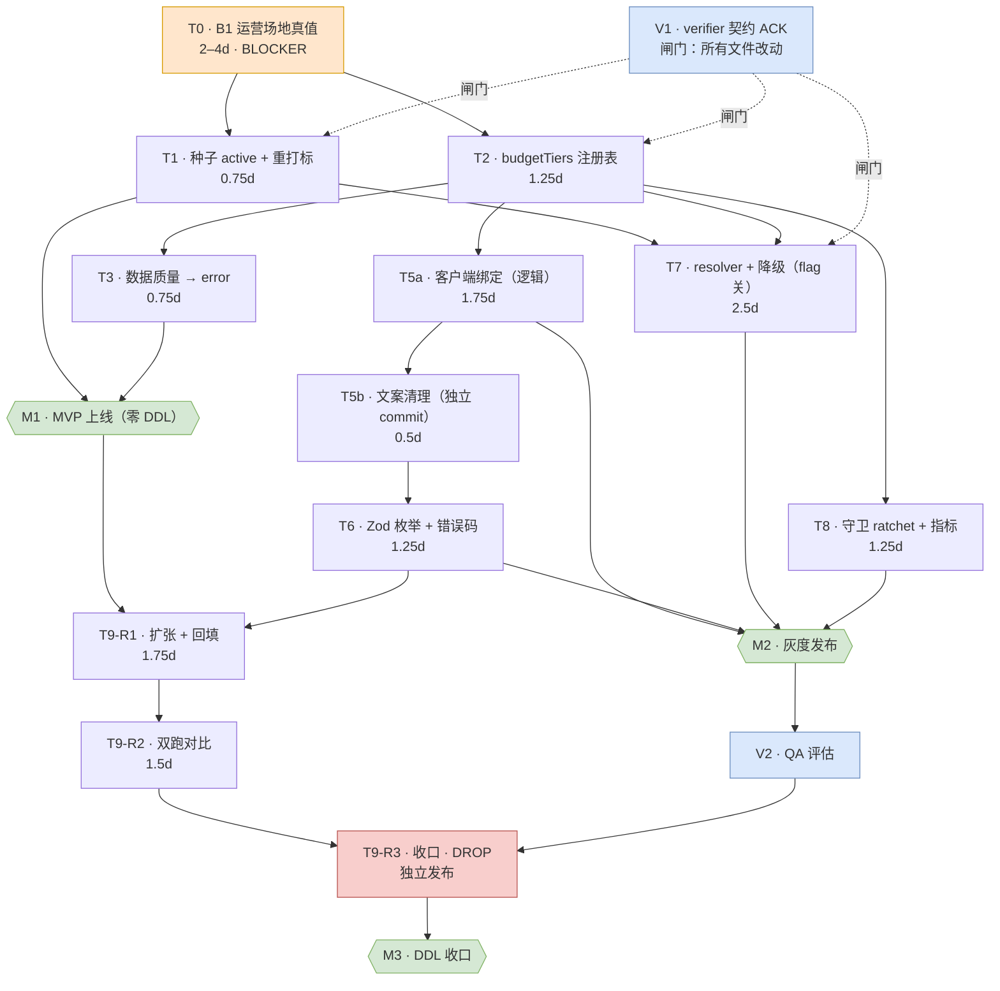

# 预算档位架构 — 实施计划（依赖 + 工期）

- **日期：** 2026-09-16
- **状态：** READY（待两项批准：@verifier 契约 ACK + T0 运营签核）
- **设计文档：** `docs/design/budget-tier-architecture-spec-20260916.md`
- **Sprint Contract：** `.git/.orchestration/sprints/sprint-contract.budget-tier-architecture-20260916.md`
- **总工程投入：** ≈ 14.5 人天（agent）；T0 的 2–4 天为运营/产品，非 agent

> **一句话：** 让"可选最低档位"在结构上不可能产生 `budget_mismatch`；**R1 之前零 DDL**，**契约 ACK 之前零文件改动**。

**瓶颈：`T0 运营场地真值`——不是代码。** 代码无法制造供给（spec `:141`）。

---

## V1 评审结论（round 1 REJECT → 修订已应用，待 cycle 2）

@verifier 于 2026-09-16 判 **REJECT**（cycle 1/2）：2 项 focus 均裁定 + 4 项阻塞 + 8 项修订。本计划已同步更新：

| 变更 | 影响 |
|---|---|
| **T1 扩范围**：修复 Batch & Co `20:00–02:00` 跨零点档期窗口（`seed_venue_batch_and_co_20260608.sql:46-52` vs `venueAssignmentService.ts:128-129,140-141`）+ 测试 | T1 **0.75 → 1.0** |
| **T0 扩范围**：+ 档期覆盖确认（每测试池 `dateTime` 须被该档位 ≥1 个 slot 覆盖） | M0 闸门加严 |
| **T9-R1 文件范围更正**：`budget_tier_ids` 属 `event_pool_registrations`，**不是** venue 列；venue 侧不新增列 | 修正原 §7.4 的错误 |
| **AC-9 证据更换**：须新增真实执行 `scoreVenueForGroup` 的测试（原「9 场景」套件内联重实现 helper → 假阴性） | T7 加测试 |
| **AC-5 发射路径**：注册路由须把 `lib/eventPoolRegistration.ts:154` 的无码 `Error` 映射为两个 code；测试扫描范围扩至该 lib + 路由 | T6 扩范围 |
| **AC-1 在 M1 不可达** → 改为「无**代码造成**的死档位」，M1 以**全量注册表**评估；「每档位有供给」降为 **M0 运营指标**（允许书面白名单） | M1 退出条件变为可达成 |
| **FOCUS 2 裁定**：fail-fast 声明**为真**（Drizzle 0.39.1 实测展开显式列清单）；但 `DROP` 危险根因是**旧代码 schema 仍命名被删列**，验证器只是 fail-loud | 三段式规则不变，措辞修正 |

---

## 1. 任务分解

| ID | 交付物 | 触及文件 | 前置 | 工期 | 满足 AC |
|---|---|---|---|---|---|
| **T0** | **运营场地真值 + 每档位覆盖计划**：6 个场地的 `venueType` / 命名空间档位 id / 单位；每档位供给计划；**+ 档期覆盖确认**（⚠️ 新增，见 §7.1）；解决 **B2/B4/B5** | 无（仅文档；落为 spec 附录） | — | **2–4**（运营/PM） | 解锁 AC-1/2/6/7 |
| **T1a** | **幂等 SQL（现可执行）**：6 场地 `onboarding_status → 'active'` + **更新过期的 `COMMENT ON COLUMN`** + **修复 Batch & Co 夜间跨零点档期窗口（B-NEW-1 选项 a）** + 反向 down SQL。**不含重打标**（原因见 §7.10） | 新建 `apps/server/migrations/####_budget_tier_venue_activation.sql` + `_journal.json`（**不改**两个历史种子文件）+ slot 迁移 | T0 | 0.75 | AC-1/6/7（部分） |
| **T1b** | **重打标（已移至协调切换）**：`venues.budget_categories` → 命名空间 id。**不得单独发布** — `venueAssignmentService.ts:275` 裸字符串比较、`:286` 零重叠硬失败 | 与 T6（写归一化）+ T7（读归一化）**同一次发布** | T1a, T6, T7 | 0.25 | AC-6/7 |
| **T2** | 注册表 + 归一化器：`BUDGET_TIERS`、`BUDGET_TIER_BY_ID`、`getTiersForEventType`、`isValidTierId`、`LEGACY_BUDGET_LABEL_TO_TIER_ID`、`normalizeBudgetTierIds`、`formatBudgetTier`、`getOfferedTiers` + 不变量测试 | 新建 `packages/shared/src/budgetTiers.ts`；`packages/shared/src/index.ts`；`packages/shared/package.json`（**两个导出面都要**） | T0 | 1.25 | 支撑 AC-3/4/5/6/7/10 |
| **T3** | 数据质量：新增 `severity:'error'` 规则——id ∈ 注册表；不得跨命名空间（按 `venueType`） | `apps/server/src/lib/venueDataQuality.ts` | T2 | 0.75 | AC-6/7 |
| — | **▲ M1 — MVP 上线（零 DDL）** | — | T0,T1,T2,T3 | — | — |
| **T5a** | 客户端绑注册表（**仅逻辑，不混文案**）：`flowConfig.ts:36-46` 由注册表派生；`:70-72` 重取源；`poolRegistrationForm.ts:55-64` 对齐载荷；`venueConstants.ts:75-85` 派生；修 `AdminEventsPage.tsx:134-139`（**另缺 `300-500`** ⚠️ §7.8）+ `:322` 静默筛选 | mini-program + admin-client 相关文件 | T2 | 1.75 | AC-3/6/10（部分） |
| **T5b** | **独立 commit 的文案清理**：`匹配/配对` 清除（`flowConfig.ts:103,106,143,151` → 排桌）；加 `/人` 单位（Q3 修订后酒局亦为 `per_person`，后台 `venueConstants.ts` 的 `/杯` 标签同步改 `/人`）；`getStepReactionLine` 改用 `label`。全文扫描含 `getMascotStepIntro:128-131` ⚠️ §7.9 | 仅 `flowConfig.ts` | T5a | 0.5 | AC-10 |
| **T6** | 服务端严格枚举 + 错误码：`_definitions.ts:943` → `z.enum(TIER_IDS)`（+ 必填）；`venues.ts:49` 同理；`INVALID_BUDGET_TIER` + `BUDGET_TIER_REQUIRED` 同时入 `errorBaselines.ts` 的 `ErrorCode` union **与** `ERROR_TEMPLATES` | `_definitions.ts`、`errorBaselines.ts`、`venues.ts`、`registrationErrorCodes.test.ts` | T5b | 1.25 | AC-5/6 |
| **T7** | 城市×局型 resolver（带缓存，谓词镜像 `venueAssignmentService.ts:339-356`）+ **fail-open** 全量注册表 + 两段式降级（精确40/±1 20/±2 8/更远0，最多 ±1 档，`budget_adjacent`）+ 删不对称分支 `:270-273` + 类型化诊断，`unassignedBreakdown:622-645` → 指标。**全部藏 `budgetAdjacencyEnabled` 默认 false** | `venueAssignmentService.ts`、新建 resolver 模块、`venuesRepo.ts` | T1,T2 | 2.5 | AC-2/4/8/9 |
| **T8** | `check-budget-tiers.mjs` ratchet（对标 `check-class-coverage.mjs`）+ grandfathered 基线 + 夹具/demo + **注册进 `package.json:31` 的 guardrails 链** ⚠️ §7.6 | 新建脚本 + 基线 JSON + `package.json` | T2 | 1.25 | AC-11 |
| — | **▲ M2 — 灰度发布** | — | T5a,T5b,T6,T7,T8 | — | — |
| **T9-R1** | **扩张**：`ADD COLUMN budget_tier_ids text[]`（**保留** `budget_range`/`bar_budget_range`）；幂等回填；窗口期**双写两列** ⚠️ §7.3；更新**注册仓储**的显式列清单（`event_pool_registrations` 的 INSERT/mapper/UPDATE）；前后置校验 SQL。⚠️ **venue 侧不新增列**——仅复用 `budget_categories` 改值 | `_definitions.ts`、**注册仓储（非 `venuesRepo`）**、新建迁移 + 往返测试 | T6,T7,T8 | 1.75 | AC-5/6 |
| **T9-R2** | **双跑**：staging 开 flag，比较新旧派场结果。先例 `simulate:groups` + `magnetismDualRun.test.ts` | 新建/改脚本 + flag 配置 | T9-R1 | 1.5 | Reliability |
| **T9-R3** | **收口**：读切换为 `budget_tier_ids`；清守卫基线；**再单独一次发布** `DROP COLUMN` | 新建迁移 | T9-R2 | 0.5 | AC-6（后） |
| — | **▲ M3 — DDL 收口** | — | T9-R1/2/3 | — | — |
| **V1** | `@verifier` 对 Sprint Contract ACK/REJECT（**闸门：所有文件改动**，最多 2 轮） | Sprint Contract 文件 | — | 0.25 | 闸门 |
| **V2** | `@qa-agent` 逐 AC 评估 → `harness-completion-gate` → auto-eval | — | T5a…T9-R3 | 0.5 | 全部 |
| **T10** | `venue_tier_terms` 关联表——**触发式，非本轮** | — | 每档位条款出现 | — | — |

---

## 2. 关键路径与并行

**最长链（≈ 11.5 人天）：**
`T0(3) → T2(1.25) → T5a(1.75) → T5b(0.5) → T6(1.25) → T9-R1(1.75) → T9-R2(1.5) → T9-R3(0.5)`

`T7` 分支（`T0→T2→T7` = 6.75）**落在** T5a→T6 分支内部，故**不在关键路径**——但它是风险最高的任务，应在 T2 解锁后尽早启动。

**T2 解锁后的并行车道：**
- **L1（关键）** `T5a → T5b → T6`
- **L2** `T7`（服务端派场，flag 关，可并发）
- **L3** `T8`（工具/可观测，独立）
- **L4** `T1` 在 T0 冻结 id 后即可与 T2 并发（⚠️ 需 §7.2 的 id 冻结），`T3` 紧随 T2
- **L5** `V1` 与 `T0` 自批准起并行

**并行收益：** 14.5 人天压到 11.5 人天 wall-clock。

**建议偏离 spec §15：** §15 把 T9-R1 的前置设为"步骤 4–8 之后"（即 T7 与 T8 之后）。但 R1 是**纯增量**（`ADD COLUMN` + 回填，旧列不动），**不依赖** T7 的 resolver 或 T8 的守卫脚本——只需 T6。建议把 R1 提到 **M2 尾部**，M3 只留 R2+R3，M3 从 ~3.75 压到 ~2 人天，风险不增（R1 回滚 = `DROP COLUMN budget_tier_ids`，安全）。

---

## 3. 依赖 DAG



```
T0 ──┬── V1(闸门)──┬── T1 ──────────┐
     │             │                ├── M1 ──┐
     └── T2 ──┬────┘   T3 ──────────┘        │
              │                              │
              ├── T5a ── T5b ── T6 ──────┐   │
              ├── T7 ────────────────────┼───┴──► M2 ──► R1 ──► R2 ──► R3 ──► M3
              └── T8 ────────────────────┘        （R1 可移至 M2 尾部）
```

---

## 4. 里程碑与闸门

| 里程碑 | 退出条件 | 回滚检查点 |
|---|---|---|
| **M0 — B1 完成** | 6 场地真值表签核；每档位供给计划（含"将长期无覆盖"清单）；**档期覆盖 SQL 验证**；档位 id 冻结；B2/B4/B5 决定 | 无（无代码、无数据） |
| **M1 — MVP 上线（零 DDL）** | T1+T2+T3 合并；V1 ACK；`guardrails` + `typecheck` + `test -w @joyjoin/server` 全绿；AC-1/6/7 只读 SQL 绿；**代码造成的死档位数 = 0**（供给缺口列明于 M0 书面白名单） | **纯数据反向 SQL**（随 T1 交付，恢复 `onboarding_status` + `budget_categories`）。无 DDL 需回滚 |
| **M2 — 灰度** | T5a/T5b/T6/T7/T8 合并；staging `budgetAdjacencyEnabled=ON`、prod OFF；双跑证据留档；AC-2/3/4/5/8/9/10/11 绿；**AC-9 新增 `scoreVenueForGroup` 预算路径测试**绿（**不再引用**「既有 9 场景」——该套件结构性假阴性） | **关 `budgetAdjacencyEnabled`**；必要时回退 T5a 绑定 commit |
| **M3 — DDL 收口** | R1→R2→R3 **分三次发布**；前后置 SQL 对齐；`npm run db:verify` 绿；DROP 后 AC-5/6/7 绿 | **R1：**`DROP COLUMN budget_tier_ids` + 回退部署。**R3：**旧列已删 → 需**发布前 DB 快照**，回滚 = 恢复列 + 部署上一版 |

---

## 5. 归属与负责角色

| 任务 | Agent | 域技能 |
|---|---|---|
| T0 | `@product-manager`（把运营表固化为 spec 附录） | `draft-prd` |
| T1 | `@backend-engineer` | `database-migration-safety` |
| T2 | `@backend-engineer` | `api-contract-versioning`、`monorepo-workspace-governance` |
| T3 | `@backend-engineer` | `backend-models-standards` |
| T5a | `@taro-engineer`（小程序）+ `@admin-client-frontend`（后台）——**两条独立车道** | `mini-program-frontend-excellence`、`admin-client-frontend`、`joyjoin-brand-guidelines` |
| T5b | `@taro-engineer`（仅文案 commit） | `joyjoin-brand-guidelines` |
| T6 | `@backend-engineer` | `error-handling-patterns`、`api-contract-versioning` |
| T7 | `@backend-engineer` | `matching-domain`、`venue-location-services`、`reliability-and-state-integrity` |
| T8 | `@backend-engineer` | `platform-observability-and-ops`、`testing-and-regression-guardrails` |
| T9-R1/R2/R3 | `@backend-engineer` + `database-migration-safety` | `reliability-and-state-integrity`、`database-migration-safety` |
| V1 | `@verifier` | `sprint-contract` |
| V2 | `@qa-agent` → `harness-completion-gate` → `auto-eval` | `pre-ship-pipeline` |

**治理建议：** 主契约覆盖 Tier 2/3 全景，但 **T7（核心派场引擎）** 与 **T9-R3（DROP）** 是仅有的两个不可逆/高爆炸半径步骤 → 建议为它们各加一份独立子契约，而不是让一份宽契约覆盖。

---

## 6. 确定性验证命令

```
npm run guardrails                  # 含 T8 新增的 check-budget-tiers.mjs
npm run test -w @joyjoin/server     # 含 registrationErrorCodes / venuesRepoCamelCase / magnetismDualRun
npm run build:weapp -w mini-program && npm run verify:subpackage-styles -w mini-program
npm run simulate:groups             # T9-R2 双跑体量证据
npm run db:verify                   # M3 闸门
npm run harness:gate                # 五支柱收口
```

只读 SQL 闸门：死档位聚合（AC-1）；`SELECT DISTINCT unnest(budget_categories) FROM venues`（AC-6）；按 `venueType` 的命名空间检查（AC-7）。

---

## 7. 风险调整说明（设计文档未声明的依赖，均已核实）

1. **AC-1 要求"有档期"，不只是 `active`。** 档期已随种子写入（`seed_venue_time_slots_20260602.sql:5`、`seed_venue_batch_and_co_20260608.sql:45`），但 B1 的交付物（spec §13）未含档期；而 `checkTimeSlotAvailability`（`venueAssignmentService.ts:114-142`）按 `dayOfWeek` + 时间窗匹配——**槽位存在 ≠ 槽位匹配测试池的排期**。**兜底：** M0 用 SQL 验证每档位档期覆盖，缺口并入 T1。
2. **档位 id 是横跨 T1/T2 的冻结契约。** §15 把 T1（数据）排在 T2（注册表）之前，但 T1 的 SQL 硬编码了只有 T2 定义的 id。若二者发散，AC-6 失败且 T1 需重做。**兜底：** 在 T0/T2-pre 冻结 id 集合，视为不可变接口。
3. **注册侧双写窗口是数据丢失风险。** R1（`ADD COLUMN`）到 R3（`DROP`）之间，新 `event_pool_registrations` 行必须**两列都写**，否则 R3 丢数据。spec §14.8 的"不双写"针对场地 `price_range`/`bar_price_range`，**不适用于注册列**。**兜底：** R1 双写；加"`budget_tier_ids` 为 NULL"监控；R3 前跑一次对账回填。
4. **（V1 round 1 已更正）`budget_tier_ids` 属 `event_pool_registrations`，不是 venue 列。** venue 侧复用 `budget_categories`、只改值、不新增列。真正的静默失效面在**注册仓储**：显式 INSERT 列清单 + duck-typed mapper 会无声吞掉新列。**兜底：** 往返测试打在**注册仓储**上（create → get → getAll），而非 `venuesRepoCamelCase.test.ts`。
5. **`event_pools.event_type` 风险（已修正表述）。** DB 列是**无约束 varchar**（`_definitions.ts:399`，注释 `饭局/酒局/其他`）；Zod 枚举存在于 `:918`（值：`饭局`/`酒局`/`其他`）；`adminEventPools.ts:29` 收 `z.string()`。`venueAssignmentService.ts:335` 用严格 `=== "酒局"` → **第三个值 `其他` 会被静默当作饭局**，且 resolver 的 `城市 × 局型` 缓存键不稳定。**把 B7 从"风险"升级为 M0 前的验证项。**
6. **AC-11 需要 CI 接线，spec §8.2 未声明。** `check-budget-tiers.mjs` 必须加进 `package.json:31` 的 `guardrails` 链（当前止于 `check-class-coverage.mjs`）。否则 AC-11 不可证。
7. **`COMMENT ON COLUMN venues.budget_categories` 仍写着旧词汇**（`20260203000000_add_venue_budget_categories.sql:40`）。T1 必须更新，否则 DB 残留第二真源——正是 spec §3/§14.1 反对的味道。
8. **`AdminEventsPage.tsx` 缺陷（T5a 已核实并修正，原述有误）：** 原文称 `budgetOptions` "漏了 `300-500`" —— **不可复现**（`:138` 早已包含，经 `git log -S` 确认）。真实缺陷是：库存（盲盒）词表 `100-200` **没有对应筛选项**，且比较用 `/`-拼接后的**精确字符串匹配** → 多选行静默筛不出。T5a 已修比较逻辑并把选项列表/联合类型改为**派生**（无法再生"不可达选项"）。B3（`100-200` 映射）仍未决，故未新增该选项。
9. **AC-10 的文案扫描须覆盖整个 `flowConfig.ts`**，不止四处引用——`getMascotStepIntro`（`:128-131`）也含用户可见文案。
10. **⚠️（T1 拆分原因）重打标不能单独上线。** `venueAssignmentService.ts:275` 用**裸字符串相等**（`groupBudget.includes(vb)`）比较场地与组的预算值，`:286` 零重叠即**硬失败 `score:0`**。若只把场地值改为 id 而注册侧仍存旧标签（`200-300`），**每个组都会 `budget_mismatch`** —— 比不重打标更糟。故 T1 拆为 **T1a**（激活，零语义变更、立即可发）与 **T1b**（重打标，必须与写/读归一化 T6+T7 **同一次发布**）。

**逐任务滑期兜底：**

| 任务 | 滑期模式 | 兜底 |
|---|---|---|
| T0 | 运营无法确认供给 | M1 仅发基础设施（注册表 + error 规则 + 守卫），标记 **AC-1/AC-2 NOT MET**；**不启用** `budgetAdjacencyEnabled`（那会掩盖缺口，spec §14.6） |
| T0 | B2/B3/B5 未决 | 冻结注册表 v1 并**预留命名空间**，新档位可追加而不重排 `order`；后续 fast-follow |
| T1 | 遗留标签无法映射 → AC-6 失败 | UPDATE 前先 `SELECT DISTINCT unnest(...)` 差异比对，遇未映射值 fail-closed |
| T2 | 缺 subpath 导出 → 小程序构建断 | 契约测试断言**两个导出面**均可解析 |
| T5a | id 变了但载荷仍旧 | 同一 PR 改两者 + 断言载荷 == 注册表 id 的测试 |
| T6 | 陈旧客户端仍发旧值 → 400（R4） | L2 收紧前先部署并可观测 L1 归一化器；对"归一化命中数"打指标 |
| T7 | 降级抬高实际价位 | flag 默认关 + 双跑；若观测到涨价，只保留严格遍、关闭软遍 |
| T7 | 6 人测试池证据不足 | `simulate:groups` 蒙特卡洛补体量 + `magnetismDualRun.test.ts` 保确定性 |
| T9-R1 | 忘记双写 | NULL 计数监控 + R3 前对账回填 |
| T9-R3 | **`DROP` 与 R1 同发布 → 生产启动失败** | 独立发布；手动 DDL **先于**停止读旧列的代码部署；发布前 DB 快照 |

---

## 8. 批准后的首批交接（V1 返回 ACK 前**不得改动任何文件**）

1. **→ `@verifier`** — 评审 Sprint Contract `budget-tier-architecture-20260916`（DRAFT，Negotiation Log PENDING）。ACK 或 REJECT + 修订，最多 2 轮。重点核验 AC-1 的"有档期"要求，以及 §15 中关于 `db.ts:74-104` fail-fast 语义的 R1 前置声明。
2. **→ `@product-manager` + 运营（无代码）** — 执行 T0：交付 6 场地真值表、每档位覆盖计划、**档期覆盖验证**，以及 B2/B4/B5 的决定。这是 M0 闸门。

**仅在 V1 ACK 且 T0 签核后** → `@backend-engineer` 启动 T2（注册表），与 T1 并发，因为 T2 解锁五个下游任务。

---

## 9. 模型建议

| 任务组 | 模型 | 倍率 | 理由 |
|---|---|---|---|
| T1, T2, T3, T5a, T6, V1, V2 | **DeepSeek V4 Pro** | 1.00x | 默认发版层；1M 上下文利于跨工作区 + shared 包一致性 |
| **T7**（resolver + 降级 + 诊断） | **DeepSeek V4 Pro**（`reasoning_effort: max`） | 1.00x | 高利害 → Pro + 思考最大；跨全部组派场、对抗性边界（档位抬价） |
| **T9-R1/R2/R3** | **GLM 5.1** | 3.00x | 架构/系统重构/迁移；长周期多发布纪律 + 不可逆 `DROP` |
| T5b, T8 | **DeepSeek V4 Flash** | 0.33x | 机械性：文案替换；守卫脚本克隆自 `check-class-coverage.mjs`。合并前 Pro 复核 |
| T0 | 无（人工） | — | 运营数据 |

**预估 premium-request 成本：≈ 500 单位（±40%）**，GLM 迁移步骤约占 45%。前提：约 13–18 个 agent 任务段；不含 T0 运营工时。
